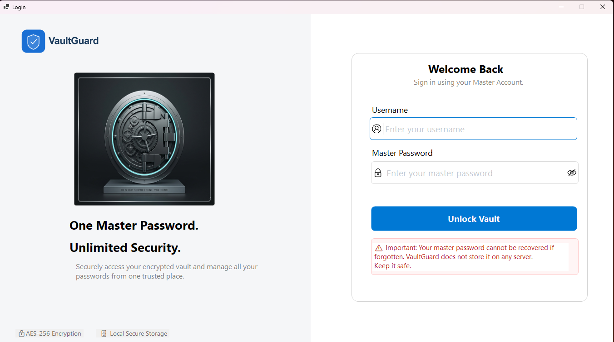
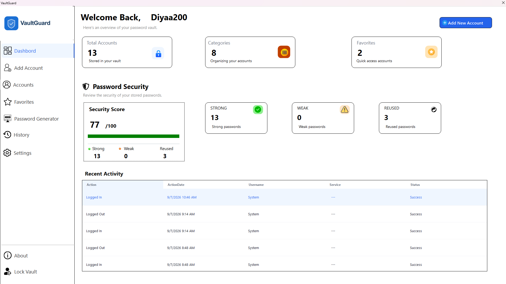
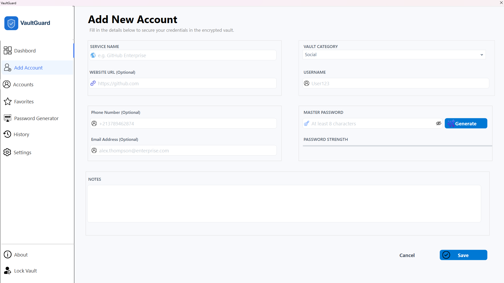
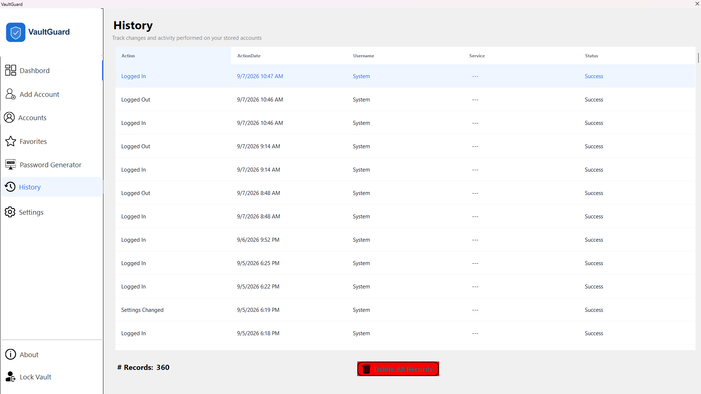
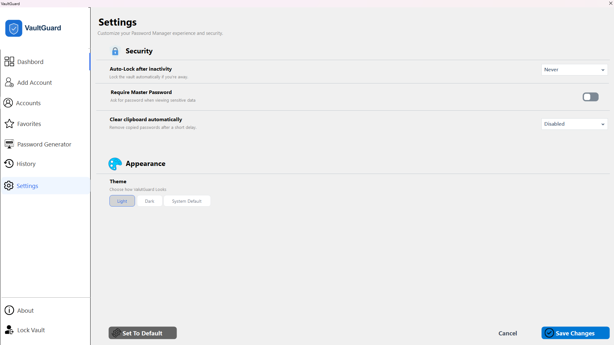

# 🔐 Password Manager

A desktop Password Manager built with **C#**, **Windows Forms**, and **SQL Server**.  
The project was created as a practical learning project to explore application architecture, database development, cryptography, and secure handling of sensitive data.

> **Security Disclaimer:** This is a learning and portfolio project. It has not undergone a professional security audit and should not be considered production-grade security software.

---

## 📌 Overview

The application provides a centralized place to manage account credentials while protecting stored passwords through encryption.

The main goal of the project was not only to build a functional desktop application, but also to understand how cryptographic concepts can be applied to a real application.

---

## ✨ Features

- 🔐 Master Password authentication
- 🔒 AES encryption for stored account passwords
- 🧩 PBKDF2 for deriving a Key Encryption Key (KEK)
- 🔑 KEK / MEK key hierarchy
- 👤 Account management
- ⭐ Favorite accounts
- 🔎 Account management and filtering
- 🎲 Password generator
- 📋 Clipboard timeout
- 🔒 Automatic locking after inactivity
- 📜 Activity history
- ⚙️ Application settings
- 🎨 Windows Forms user interface

---

## 🛡️ Security Architecture

The application does not store the Master Password directly.

A simplified view of the key hierarchy is:

```text
Master Password
       │
       ▼
     PBKDF2
       │
       ▼
      KEK
       │
       │ protects
       ▼
      MEK
       │
       │ AES
       ▼
Encrypted Account Passwords
```

### Master Password

The Master Password is entered by the user and is not stored directly in the database.

### PBKDF2

PBKDF2 is used as a **Key Derivation Function (KDF)** to derive a cryptographic key from the Master Password and a salt.

### KEK — Key Encryption Key

The derived KEK is used to protect the MEK rather than being used directly to encrypt every account password.

### MEK — Master Encryption Key

The MEK is a randomly generated encryption key used to encrypt the account passwords.

This separation provides a key hierarchy in which:

- **KEK protects the MEK**
- **MEK protects the vault data**

This also makes key management more flexible. For example, changing the Master Password can be handled by re-protecting the MEK rather than re-encrypting every account password.

---

## 🏗️ Architecture

The application follows a **3-Tier Architecture**:

```text
┌──────────────────────────────┐
│      Presentation Layer      │
│      Windows Forms / UI      │
└──────────────┬───────────────┘
               │
               ▼
┌──────────────────────────────┐
│      Business Layer          │
│   Business Logic / Rules     │
└──────────────┬───────────────┘
               │
               ▼
┌──────────────────────────────┐
│      Data Access Layer       │
│       ADO.NET / SQL          │
└──────────────┬───────────────┘
               │
               ▼
          SQL Server
```

### Projects

- **PasswordsManagement** — Presentation layer and user interface
- **PasswordsManagement-Business** — Business logic and application models
- **PasswordsManagement-DataAccess** — Database access and SQL operations

---

## 🛠️ Technologies

- Language: C#
- Framework: .NET Framework (Windows Forms)
- Database: Microsoft SQL Server
- Data Access: ADO.NET
- UI Library: Guna2 UI
- IDE: Visual Studio 2022

---

## 📸 Screenshots
Example:

```markdown





```

---

## 🎯 What I Learned

This project helped me practice and understand:

- Object-Oriented Programming
- 3-Tier application architecture
- Database design and SQL Server
- ADO.NET and data access
- Symmetric encryption
- Hashing and key derivation
- PBKDF2, Salt, IV, KEK, and MEK
- Secure handling of sensitive information
- Session security and automatic locking
- Clipboard security
- Building a complete desktop application

---


---
---

## 🚀 Setup & Installation

Follow the steps below to set up the project locally.

### 📋 Prerequisites

Before running the application, make sure you have the following installed:

- **Visual Studio 2022** with the **.NET desktop development** workload
- **SQL Server Management Studio (SSMS)** or another SQL Server management tool
---


### Installation & Setup
- Clone the Repository: git clone https://github.com/your-username/PasswordsManagement.git
- Database Setup: Restore the PasswordsManagement.bak file in SSMS.
- Build and Run: Build the solution to restore NuGet packages and press F5.


---

## 👨‍💻 Author

**Diyaa Eddine**

This project was developed as part of my journey in software development, with a particular focus on C#, databases, application architecture, and cybersecurity concepts.
